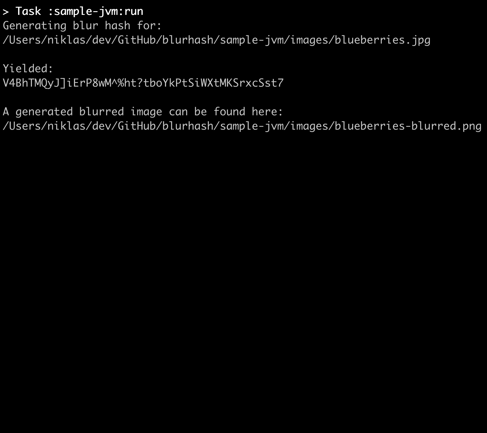

blurhash
========

A Kotlin Multiplatform library to use [blurhash](https://blurha.sh/) in your Android App, iOS / Mac App & JVM Backend.

| `Android`                             | `iOS`                         | `JVM`                         |
|:--------------------------------------|:------------------------------|:------------------------------|
|  |  |  |

# Why?

If you've tried using [blurhash](https://blurha.sh/), you qickly stumple upon the [main repository](https://github.com/woltapp/blurhash). They provide sources for [Swift](https://github.com/woltapp/blurhash/tree/master/Swift), [Typescript](https://github.com/woltapp/blurhash/tree/master/TypeScript), [Python](https://github.com/woltapp/blurhash-python), [Kotlin](https://github.com/woltapp/blurhash/tree/master/Kotlin) and [C](https://github.com/woltapp/blurhash/tree/master/C). However:

- Implementations produce [different hashes for the same picture](https://github.com/woltapp/blurhash/issues/196)
- There are no artifacts to consume i.e. no Cocoa Pod or Maven dependency
- Not all implementations provide both encoding and decoding support
- Missing sample apps with consistent images and blur hashes

The goal of this library is to solve all of the above mentioned problems, provide a common API and good samples for each platform.

# Usage

From Kotlin Multiplatform:

```groovy
kotlin {
  sourceSets {
    val commonMain by getting {
      dependencies {
        implementation("com.vanniktech:blurhash:0.2.0")
      }
    }
  }
}
```

From Android / JVM Multiplatform:

```groovy
dependencies {
  implementation("com.vanniktech:blurhash:0.2.0")
}
```

From iOS:

```ruby
pod 'BlurHash', :git => 'https://github.com/vanniktech/blurhash', :tag => "0.2.0"
```

# API

Use `com.vanniktech.blurhash.BlurHash` directly in your platform specific code to `encode` as well as `decode`:

- [sample-android](./sample-android/src/main/kotlin/com/vanniktech/blurhash/sample/android/BlurHashMainActivity.kt): Works with `Bitmap`
- [sample-ios](./sample-ios/ios/App.swift): Works with `UIImage` (Use `import blurhash` & `BlurHash.shared`)
- [sample-jvm](sample-jvm/src/main/java/com/vanniktech/blurhash/sample/jvm/BlurHashJvm.kt): Works with `BufferedImage`

# Thanks

Without them this would not exist!

- [woltapp](https://github.com/woltapp) for creating [blurbash](https://github.com/woltapp/blurhash)
- [Hendrik Schnepel](https://github.com/hsch) for the [encoding implementation](https://github.com/hsch/blurhash-java)

# License

Copyright (C) 2022 - Niklas Baudy

Licensed under the MIT License
